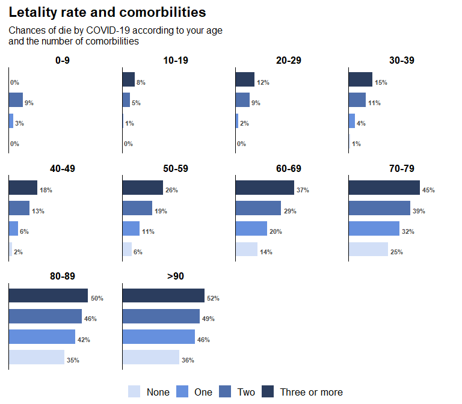

# **Insights into COVID-19 outbreak in Mexico**

In 2021, Mexico found itself grappling with an ongoing and dynamic
battle against the COVID-19 outbreak. The year marked a significant
period in the nation’s fight against the pandemic, presenting numerous
challenges and evolving dynamics. As cases surged and new variants
emerged, the country’s healthcare system, government, and communities
faced immense pressure to respond effectively and mitigate the spread of
the virus. Throughout this critical year, Mexico witnessed varying
degrees of success and setbacks in controlling the outbreak, prompting
the implementation of a range of public health measures and vaccination
campaigns. This introduction aims to provide a comprehensive context for
understanding the situation of the COVID-19 outbreak in Mexico during
2021, highlighting the key developments, trends and indicators to show
the magnitude of the pandemic in the nation.

Under AMLO’s term, Mexico was probably the only country in the western
hemisphere who kept theirs gates open for regular transit and normality
in commercial activities, which somehow helped keep the economy afloat.
At what cost though?

image.

# **COVID-19 in Mexico: Navigating a Challenging Year - 2021 Overview**

Mexico faced a pivotal and challenging year in its battle against the
COVID-19 pandemic. The nation confronted waves of infections, struggled
with healthcare capacity limitations, and navigated through various
phases of lockdowns and restrictions to mitigate the spread of the
virus. Throughout this arduous period, health authorities, frontline
workers, and communities came together to combat the pandemic’s impact
on public health and the economy. For a comprehensive analysis of
Mexico’s experience with COVID-19 in 2021, from the evolving infection
rates to vaccination campaigns and the impact on vulnerable populations,
this overview delves into the nation’s efforts in navigating the
complexities of COVID-19, highlighting both achievements and lessons
learned.

The `open_data_mex` dataset contains all positive cases registered in
2021, as well as information about each the patient. In this report, we
aim to provide detailed information on the how the pandemic evolved
along that year and how the population has been affected ever since.

Information used here was obtained from the [open
data](https://www.gob.mx/salud/documentos/datos-abiertos-152127)
provided by the Mexican General Direction of Epidemiology, which gathers
information on the cases associated to COVID-19 in every state of the
republic. Let’s start by looking at the distribution of positives cases
across the country.

| State               | Infection rate |
|:--------------------|---------------:|
| Ciudad de México    |            7.1 |
| Baja California Sur |            5.9 |
| Tabasco             |            4.1 |
| Colima              |            3.5 |
| Querétaro           |            2.8 |
| Quintana Roo        |            2.6 |

# **Tracing the evolution of a pandemic in 2021**

The year presented a series of challenges as COVID-19 cases surged,
subsided, and resurged in various waves. The nation’s healthcare system,
government, and communities tirelessly navigated through the
ever-changing landscape, implementing a range of measures to contain the
spread of the virus. The emergence of new variants, vaccination
campaigns, and the impact on vulnerable populations were among the key
milestones that shaped the pandemic’s trajectory. Through a
comprehensive analysis of data and trends, this examination offers
valuable insights into the progression of COVID-19 in Mexico throughout
2021. An average of the total cases a day was calculated as the
inter-quantile range (IQR) for every month.

Although the number of cases per month in 2021 behaved similar for men a
women, there’s a significant difference **(p\<0.05)** in the number of
deaths for each sex derived from COVID-19 infection, resulting in a case
fatality rate of 4.4% and 6.81% for female and male respectively, which
suggest a significant higher chance of dying by COVID-19 if you were a
man in 2021. Nonetheless, it might sound like a dangerous assumption
since we’d be ignoring individual aspects of each patient that cause
them to end up hospitalized and subsequently die.

# **The Age-Dependent Dichotomy: Ambulatory vs. Hospitalized Patients in the COVID-19 Landscape**

In Mexico during 2021, age played a crucial role in determining the
likelihood of being hospitalized due to COVID-19. Older adults,
particularly those above 65 years, faced higher chances of
hospitalization compared to younger age groups. The elderly are more
susceptible to severe outcomes because of age-related declines in the
immune system and a higher prevalence of underlying health conditions.
However, it is essential to note that hospitalization rates also
depended on other factors such as vaccination status, regional
variations in healthcare capacity, and adherence to public health
measures. Here is a comparison between ambulatory and hospitalized cases
by age group in Mexico 2021.

# **COVID-19 Mortality: Unveiling the Impact of Age on Fatality Risks**

The impact of age and pre-existing health conditions on the fatality of
COVID-19 infections in Mexico was significant. Older adults, especially
those aged 70 and above, faced a higher risk of severe outcomes and
mortality due to age-related declines in immune function. Additionally,
pre-existing health conditions such as cardiovascular diseases,
diabetes, obesity, and respiratory disorders were key factors
contributing to worse COVID-19 outcomes in Mexico. These conditions
heightened the risk of complications and fatalities, placing individuals
with such health concerns at a vulnerable position. In a general
perspective, we can observe how the fatality rate increase as the
patient’s age increase.

Even though vaccination efforts has reduced the number of deaths
compared to 2020, when pandemic started, we can see that, in a general
perspective, people above 60 years old have almost 20% chances of dying
due to COVID-19 infection, and it will increase to a 40% when people
reach 80 years old. However, it’s known that chances of dying are
correlated to main comorbilities, the more pre-existing diseases a
patient has, the higher the chance of losing the battle.

# **Unraveling the Connection: Age-Comorbilities relationship and their Influence on COVID-19 Mortality**

As the COVID-19 pandemic continues to impact communities worldwide,
understanding the intricate relationship between age, comorbidities, and
mortality becomes crucial for effective public health strategies. This
project delves into the influence of age and pre-existing health
conditions on COVID-19 mortality rates. We can see how the fatality rate
changes depending on the age group and the number of comorbilities a
patient has.

The findings from the analysis of the COVID-19 dataset in Mexico reveal
a compelling and statistically significant relationship ***(p\<0.05)***
between the probabilities of death or survival and two key factors: the
number of comorbilities and the patient’s age group. The study
demonstrated that patients with a higher number of comorbilities faced a
significantly increased likelihood of death due to COVID-19,
highlighting the critical impact of underlying health conditions on
disease outcomes. Additionally, the results revealed a clear association
between age and COVID-19 fatality rates, with older age groups showing a
higher probability of death compared to younger counterparts. These
findings underscore the importance of prioritizing vulnerable
populations, particularly those with multiple comorbilities and older
individuals, in public health measures and vaccination strategies to
mitigate the severity of COVID-19 and safeguard those at the highest
risk of adverse outcomes.
